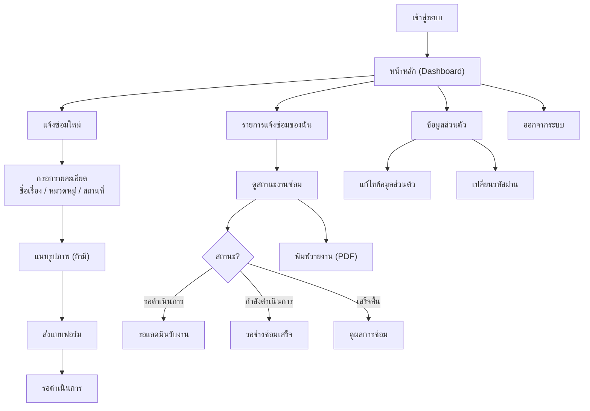
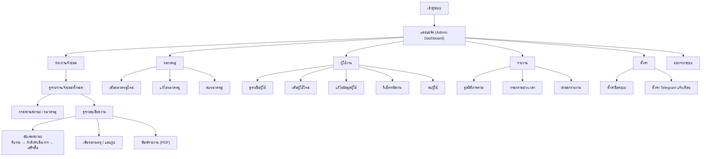
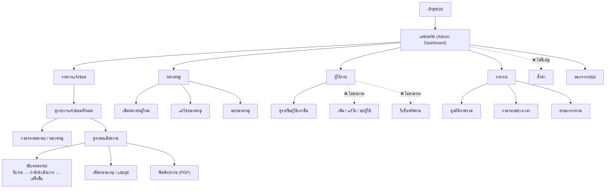

# Flowchart วิธีการใช้งานระบบแจ้งซ่อมออนไลน์ แยกตาม Role

---

## 1. ผู้ใช้งานทั่วไป (User)

---

## 2. ผู้ดูแลระบบ (Admin)

---

## 3. งานอาคาร (Building Staff)

---

## สรุปเปรียบเทียบสิทธิ์แต่ละ Role

| ฟีเจอร์ | ผู้ใช้งานทั่วไป | งานอาคาร | แอดมิน |
|---------|:-:|:-:|:-:|
| แจ้งซ่อมใหม่ | ✅ | ✅ | ✅ |
| ดูงานซ่อมของตัวเอง | ✅ | ✅ | ✅ |
| แดชบอร์ดผู้ดูแล | ❌ | ✅ | ✅ |
| จัดการรายการแจ้งซ่อม | ❌ | ✅ | ✅ |
| อัปเดตสถานะงาน | ❌ | ✅ | ✅ |
| จัดการหมวดหมู่ | ❌ | ✅ | ✅ |
| ดูรายชื่อผู้ใช้ | ❌ | ✅ | ✅ |
| เพิ่ม/แก้ไข/ลบผู้ใช้ | ❌ | ❌ | ✅ |
| รีเซ็ตรหัสผ่านผู้ใช้ | ❌ | ❌ | ✅ |
| ดูรายงาน/สถิติ | ❌ | ✅ | ✅ |
| ตั้งค่าระบบ | ❌ | ❌ | ✅ |
| พิมพ์รายงาน PDF | ✅ | ✅ | ✅ |
| แก้ไขข้อมูลส่วนตัว | ✅ | ✅ | ✅ |
