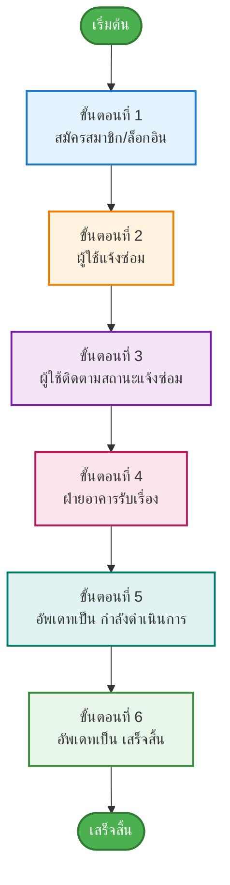
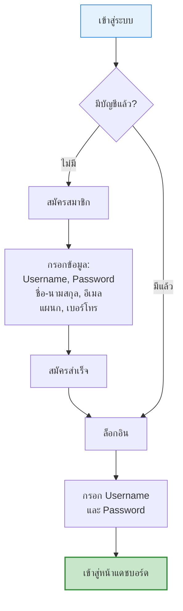
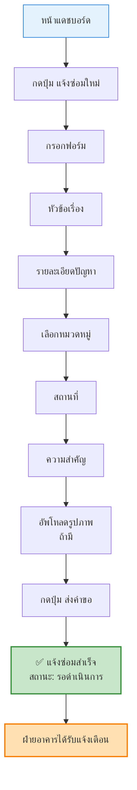
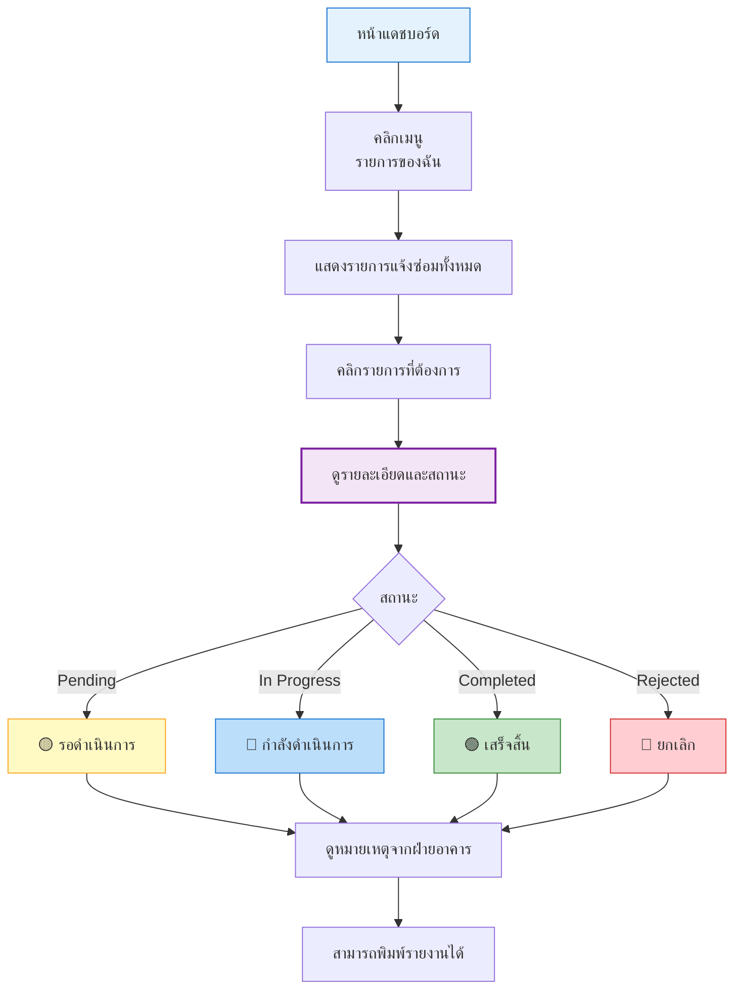
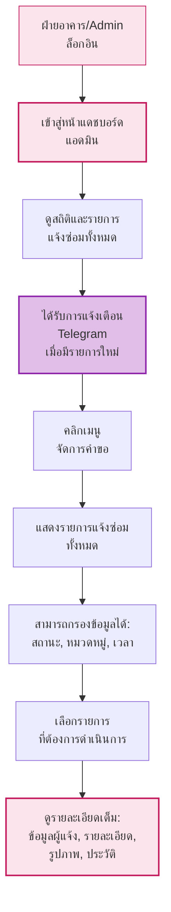
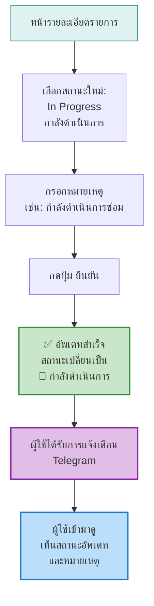
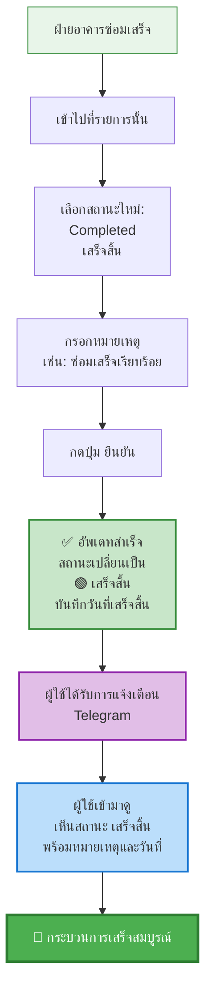

# คู่มือการใช้งานระบบแจ้งซ่อมออนไลน์

## ภาพรวมขั้นตอนการใช้งานระบบ



---

## ขั้นตอนที่ 1: การเริ่มต้นใช้งาน (สมัครสมาชิก/ล็อกอิน)



---

## ขั้นตอนที่ 2: การแจ้งซ่อม (สำหรับผู้ใช้)



---

## ขั้นตอนที่ 3: การติดตามสถานะ (สำหรับผู้ใช้)



---

## ขั้นตอนที่ 4: การรับเรื่องของฝ่ายอาคาร



---

## ขั้นตอนที่ 5: อัพเดทเป็น "กำลังดำเนินการ"



---

## ขั้นตอนที่ 6: อัพเดทเป็น "เสร็จสิ้น"



---

## สรุปสถานะทั้งหมด

| สถานะ | ไอคอน | ความหมาย |
|-------|-------|----------|
| **Pending** | 🟡 | รอดำเนินการ |
| **In Progress** | 🔵 | กำลังดำเนินการ |
| **Completed** | 🟢 | เสร็จสิ้น |
| **Rejected** | 🔴 | ยกเลิก |

---

## ตัวอย่างการใช้งานแบบง่าย

### 📝 ผู้ใช้ (นาย A)
1. สมัครสมาชิกและล็อกอิน
2. แจ้งซ่อม: "หลอดไฟเสีย" → สถานะ: **Pending** 🟡
3. ติดตามสถานะในหน้า "รายการของฉัน"

### 👷 ฝ่ายอาคาร
4. รับเรื่อง: เห็นรายการ "หลอดไฟเสีย"
5. อัพเดท: **In Progress** 🔵 → หมายเหตุ: "กำลังดำเนินการซ่อม"
6. ซ่อมเสร็จ → อัพเดท: **Completed** 🟢 → หมายเหตุ: "ซ่อมเสร็จเรียบร้อย"

### ✅ ผลลัพธ์
- นาย A ได้รับการแจ้งเตือน
- เห็นสถานะ **เสร็จสิ้น** พร้อมหมายเหตุ
- 🎉 **เสร็จสิ้น**

---

## การแจ้งเตือน Telegram

### 📱 เมื่อมีรายการใหม่ → แจ้งฝ่ายอาคาร
```
🔔 มีรายการแจ้งซ่อมใหม่!
หมายเลข: #7
หัวข้อ: หลอดไฟเสีย
หมวดหมู่: ระบบไฟฟ้า
ความสำคัญ: สูง
ผู้แจ้ง: นาย A
```

### 📱 เมื่อสถานะเปลี่ยน → แจ้งผู้ใช้
```
✅ รายการแจ้งซ่อมของคุณได้รับการอัพเดท!
หมายเลข: #7
หัวข้อ: หลอดไฟเสีย
สถานะ: เสร็จสิ้น ✅
หมายเหตุ: ซ่อมเสร็จเรียบร้อย
```
