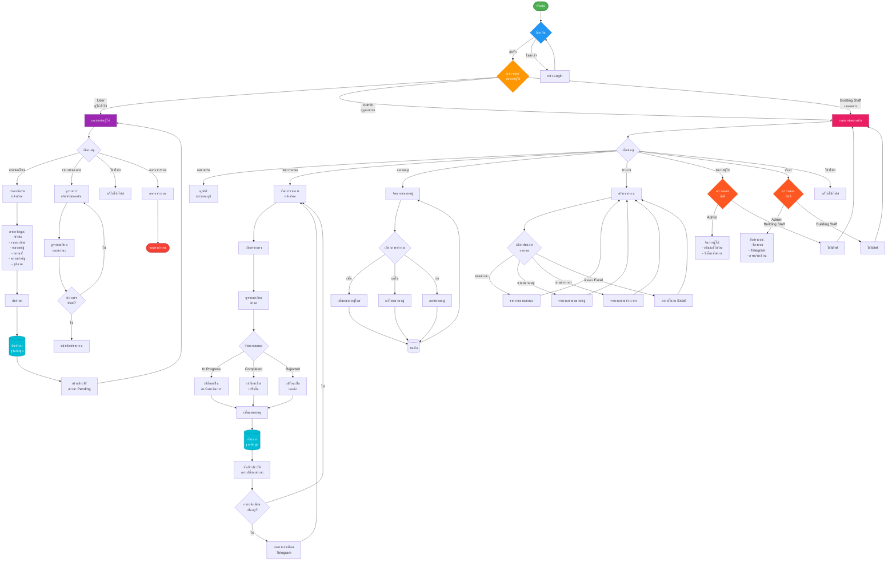
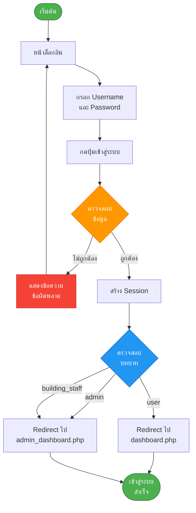
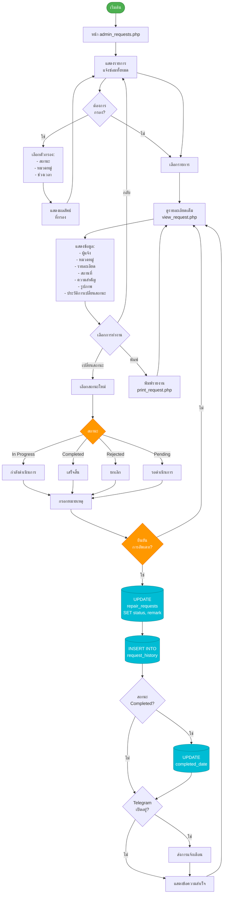
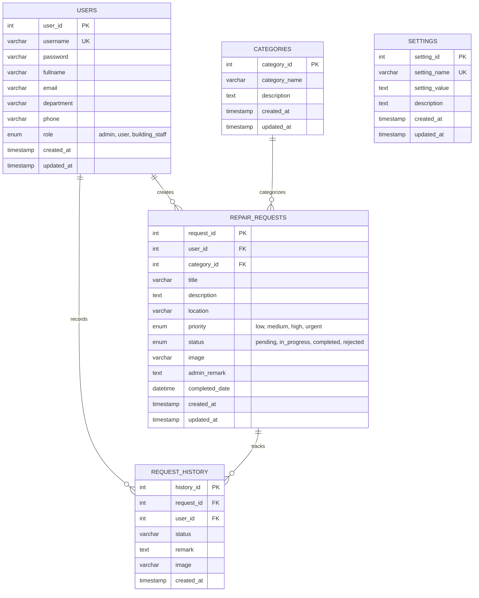
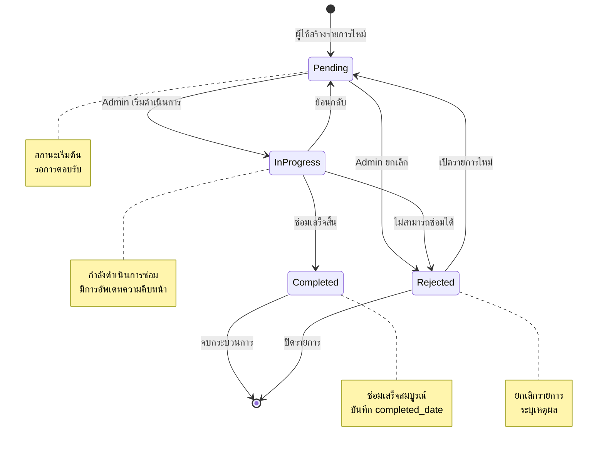
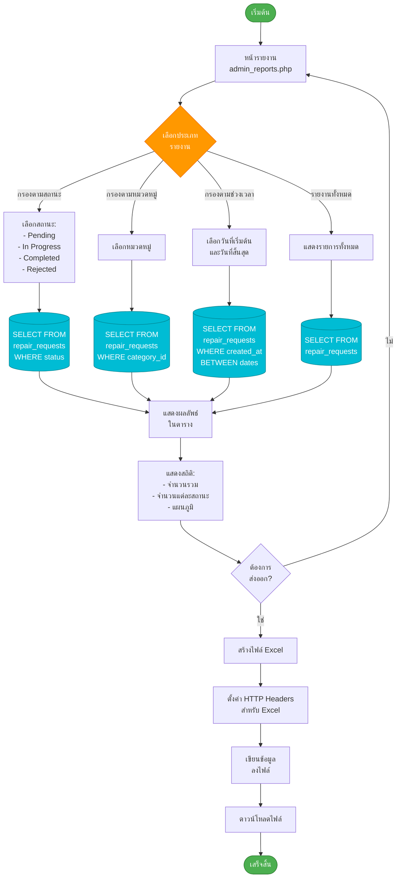
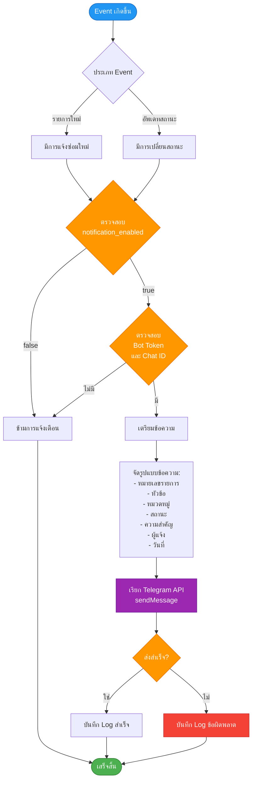

# Flowchart Diagram: ระบบแจ้งซ่อมออนไลน์

## ภาพรวมของระบบ (System Overview)

---

## 1. กระบวนการล็อกอิน (Login Process)

---

## 2. กระบวนการแจ้งซ่อม (Create Repair Request)

```mermaid
flowchart TD
    Start([เริ่มต้น]) --> ClickCreate[คลิก 'แจ้งซ่อมใหม่']
    ClickCreate --> FormPage[หน้าฟอร์ม<br/>create_request.php]
    
    FormPage --> FillData[กรอกข้อมูล]
    FillData --> InputTitle[1. หัวเรื่อง]
    InputTitle --> InputDesc[2. รายละเอียดปัญหา]
    InputDesc --> SelectCat[3. เลือกหมวดหมู่]
    SelectCat --> InputLoc[4. สถานที่]
    InputLoc --> SelectPriority[5. เลือกความสำคัญ<br/>- ต่ำ<br/>- ปานกลาง<br/>- สูง<br/>- เร่งด่วน]
    SelectPriority --> UploadImg{อัพโหลด<br/>รูปภาพ?}
    
    UploadImg -->|ใช่| SelectImage[เลือกไฟล์รูปภาพ]
    UploadImg -->|ไม่| SubmitForm
    SelectImage --> ValidateImage{ตรวจสอบ<br/>ไฟล์}
    
    ValidateImage -->|ไม่ผ่าน| ImgError[แสดงข้อผิดพลาด<br/>ไฟล์ไม่ถูกต้อง]
    ImgError --> UploadImg
    ValidateImage -->|ผ่าน| SubmitForm[กดปุ่มส่ง]
    
    SubmitForm --> ValidateForm{ตรวจสอบ<br/>ฟอร์ม}
    ValidateForm -->|ไม่สมบูรณ์| FormError[แสดงข้อผิดพลาด]
    FormError --> FillData
    
    ValidateForm -->|สมบูรณ์| SaveImage[บันทึกรูปภาพ<br/>ในโฟลเดอร์ uploads]
    SaveImage --> InsertDB[(INSERT INTO<br/>repair_requests)]
    InsertDB --> GetRequestID[ดึง request_id]
    GetRequestID --> InsertHistory[(INSERT INTO<br/>request_history<br/>status: pending)]
    InsertHistory --> CheckNotif{Telegram<br/>เปิดอยู่?}
    
    CheckNotif -->|ใช่| SendTelegram[ส่งการแจ้งเตือน<br/>Telegram]
    CheckNotif -->|ไม่| ShowSuccess
    SendTelegram --> ShowSuccess[แสดงข้อความ<br/>สำเร็จ]
    
    ShowSuccess --> RedirectDash[Redirect ไป<br/>dashboard.php]
    RedirectDash --> End([เสร็จสิ้น])
    
    style Start fill:#4CAF50,stroke:#2E7D32,color:#fff
    style End fill:#4CAF50,stroke:#2E7D32,color:#fff
    style ValidateForm fill:#FF9800,stroke:#EF6C00,color:#fff
    style ValidateImage fill:#FF9800,stroke:#EF6C00,color:#fff
    style InsertDB fill:#00BCD4,stroke:#00838F,color:#fff
    style InsertHistory fill:#00BCD4,stroke:#00838F,color:#fff
    style FormError fill:#f44336,stroke:#c62828,color:#fff
    style ImgError fill:#f44336,stroke:#c62828,color:#fff
```

---

## 3. กระบวนการจัดการคำขอ (Admin: Manage Requests)

---

## 4. โครงสร้างฐานข้อมูล (Database Structure)

---

## 5. สถานะของรายการแจ้งซ่อม (Request Status Flow)

---

## 6. สิทธิ์การเข้าถึงตามบทบาท (Role-Based Access Control)

```mermaid
flowchart TD
    User[ผู้ใช้เข้าสู่ระบบ] --> CheckRole{ตรวจสอบบทบาท}
    
    CheckRole -->|User<br/>ผู้ใช้ทั่วไป| UserPermissions[สิทธิ์การใช้งาน]
    CheckRole -->|Building Staff<br/>งานอาคาร| StaffPermissions[สิทธิ์การใช้งาน]
    CheckRole -->|Admin<br/>ผู้ดูแลระบบ| AdminPermissions[สิทธิ์การใช้งาน]
    
    UserPermissions --> U1[✓ แจ้งซ่อมใหม่]
    UserPermissions --> U2[✓ ดูรายการของตนเอง]
    UserPermissions --> U3[✓ ดูรายละเอียดคำขอ]
    UserPermissions --> U4[✓ พิมพ์รายงาน]
    UserPermissions --> U5[✓ แก้ไขโปรไฟล์]
    UserPermissions --> U6[✗ จัดการคำขอ]
    UserPermissions --> U7[✗ จัดการผู้ใช้]
    UserPermissions --> U8[✗ จัดการหมวดหมู่]
    UserPermissions --> U9[✗ ตั้งค่าระบบ]
    
    StaffPermissions --> S1[✓ แจ้งซ่อมใหม่]
    StaffPermissions --> S2[✓ ดูรายการทั้งหมด]
    StaffPermissions --> S3[✓ จัดการคำขอ]
    StaffPermissions --> S4[✓ เปลี่ยนสถานะ]
    StaffPermissions --> S5[✓ จัดการหมวดหมู่]
    StaffPermissions --> S6[✓ ดูรายงาน]
    StaffPermissions --> S7[✓ แก้ไขโปรไฟล์]
    StaffPermissions --> S8[✓ ดูรายชื่อผู้ใช้]
    StaffPermissions --> S9[✗ จัดการผู้ใช้]
    StaffPermissions --> S10[✗ ตั้งค่าระบบ]
    
    AdminPermissions --> A1[✓ แจ้งซ่อมใหม่]
    AdminPermissions --> A2[✓ ดูรายการทั้งหมด]
    AdminPermissions --> A3[✓ จัดการคำขอ]
    AdminPermissions --> A4[✓ เปลี่ยนสถานะ]
    AdminPermissions --> A5[✓ จัดการหมวดหมู่]
    AdminPermissions --> A6[✓ ดูรายงาน]
    AdminPermissions --> A7[✓ แก้ไขโปรไฟล์]
    AdminPermissions --> A8[✓ จัดการผู้ใช้]
    AdminPermissions --> A9[✓ ตั้งค่าระบบ]
    AdminPermissions --> A10[✓ ตั้งค่า Telegram]
    
    style CheckRole fill:#FF9800,stroke:#EF6C00,color:#fff
    style UserPermissions fill:#2196F3,stroke:#1565C0,color:#fff
    style StaffPermissions fill:#9C27B0,stroke:#6A1B9A,color:#fff
    style AdminPermissions fill:#f44336,stroke:#c62828,color:#fff
    
    style U6 fill:#ffebee,stroke:#c62828
    style U7 fill:#ffebee,stroke:#c62828
    style U8 fill:#ffebee,stroke:#c62828
    style U9 fill:#ffebee,stroke:#c62828
    style S9 fill:#ffebee,stroke:#c62828
    style S10 fill:#ffebee,stroke:#c62828
```

---

## 7. กระบวนการสร้างรายงาน (Report Generation)

---

## 8. ระบบการแจ้งเตือน Telegram (Telegram Notification)

---

## สรุปฟีเจอร์หลักของระบบ

### สำหรับผู้ใช้ทั่วไป (User)
- ✅ แจ้งซ่อมออนไลน์พร้อมแนบรูปภาพ
- ✅ ติดตามสถานะรายการแจ้งซ่อม
- ✅ ดูประวัติการแจ้งซ่อมทั้งหมด
- ✅ พิมพ์รายงาน
- ✅ จัดการโปรไฟล์ส่วนตัว

### สำหรับงานอาคาร (Building Staff)
- ✅ ฟีเจอร์ทั้งหมดของผู้ใช้ทั่วไป
- ✅ ดูรายการแจ้งซ่อมทั้งหมด
- ✅ เปลี่ยนสถานะรายการแจ้งซ่อม
- ✅ เพิ่มหมายเหตุ
- ✅ จัดการหมวดหมู่
- ✅ ดูรายงานและสถิติ
- ✅ ดูรายชื่อผู้ใช้
- ❌ จัดการผู้ใช้ (เพิ่ม/แก้ไข/ลบ)
- ❌ ตั้งค่าระบบ

### สำหรับผู้ดูแลระบบ (Admin)
- ✅ ฟีเจอร์ทั้งหมดของงานอาคาร
- ✅ จัดการผู้ใช้ (เพิ่ม/แก้ไข/ลบ/รีเซ็ตรหัสผ่าน)
- ✅ ตั้งค่าระบบ
- ✅ ตั้งค่าการแจ้งเตือน Telegram
- ✅ ดูแลระบบแบบเต็มรูปแบบ

### ฟีเจอร์เพิ่มเติม
- 📊 แดชบอร์ดแสดงสถิติแบบเรียลไทม์
- 📈 กราฟและแผนภูมิแสดงข้อมูล
- 📱 การแจ้งเตือนผ่าน Telegram
- 📄 ส่งออกรายงานเป็น Excel
- 🖨️ พิมพ์รายงานแบบมืออาชีพ
- 🔐 ระบบจัดการสิทธิ์ตามบทบาท
- 📜 บันทึกประวัติการเปลี่ยนสถานะทั้งหมด
- 🔒 ป้องกัน SQL Injection
- 📱 Responsive Design รองรับทุกอุปกรณ์
