# Flowchart Diagram: ระบบแจ้งซ่อมออนไลน์

## ภาพรวมของระบบ (System Overview)

```mermaid
flowchart TD
    Start([เริ่มต้น]) --> Login{ล็อกอิน}
    
    Login -->|สำเร็จ| CheckRole{ตรวจสอบ<br/>บทบาทผู้ใช้}
    Login -->|ไม่สำเร็จ| LoginPage[หน้า Login]
    LoginPage --> Login
    
    CheckRole -->|User<br/>ผู้ใช้ทั่วไป| UserDashboard[แดชบอร์ดผู้ใช้]
    CheckRole -->|Admin<br/>ผู้ดูแลระบบ| AdminDashboard[แดชบอร์ดแอดมิน]
    CheckRole -->|Building Staff<br/>งานอาคาร| AdminDashboard
    
    %% User Flow
    UserDashboard --> UserAction{เลือกเมนู}
    UserAction -->|แจ้งซ่อมใหม่| CreateRequest[กรอกฟอร์ม<br/>แจ้งซ่อม]
    UserAction -->|รายการของฉัน| MyRequests[ดูรายการ<br/>แจ้งซ่อมของฉัน]
    UserAction -->|โปรไฟล์| UserProfile[แก้ไขโปรไฟล์]
    UserAction -->|ออกจากระบบ| Logout[ออกจากระบบ]
    
    CreateRequest --> FillForm[กรอกข้อมูล:<br/>- หัวข้อ<br/>- รายละเอียด<br/>- หมวดหมู่<br/>- สถานที่<br/>- ความสำคัญ<br/>- รูปภาพ]
    FillForm --> SubmitRequest[ส่งคำขอ]
    SubmitRequest --> SaveToDB[(บันทึกลง<br/>ฐานข้อมูล)]
    SaveToDB --> CreateHistory[สร้างประวัติ<br/>สถานะ Pending]
    CreateHistory --> UserDashboard
    
    MyRequests --> ViewDetails[ดูรายละเอียด<br/>และสถานะ]
    ViewDetails --> PrintReport{ต้องการ<br/>พิมพ์?}
    PrintReport -->|ใช่| PrintPage[หน้าพิมพ์รายงาน]
    PrintReport -->|ไม่| MyRequests
    
    %% Admin/Building Staff Flow
    AdminDashboard --> AdminAction{เลือกเมนู}
    AdminAction -->|แดชบอร์ด| ViewStats[ดูสถิติ<br/>และแผนภูมิ]
    AdminAction -->|จัดการคำขอ| ManageRequests[จัดการรายการ<br/>แจ้งซ่อม]
    AdminAction -->|หมวดหมู่| ManageCategories[จัดการหมวดหมู่]
    AdminAction -->|รายงาน| Reports[สร้างรายงาน]
    AdminAction -->|จัดการผู้ใช้| CheckAdminRole{ตรวจสอบ<br/>สิทธิ์}
    AdminAction -->|ตั้งค่า| CheckAdminRole2{ตรวจสอบ<br/>สิทธิ์}
    AdminAction -->|โปรไฟล์| AdminProfile[แก้ไขโปรไฟล์]
    
    CheckAdminRole -->|Admin| ManageUsers[จัดการผู้ใช้:<br/>- เพิ่ม/แก้ไข/ลบ<br/>- รีเซ็ตรหัสผ่าน]
    CheckAdminRole -->|Building Staff| Denied1[ไม่มีสิทธิ์]
    Denied1 --> AdminDashboard
    
    CheckAdminRole2 -->|Admin| Settings[ตั้งค่าระบบ:<br/>- ชื่อระบบ<br/>- Telegram<br/>- การแจ้งเตือน]
    CheckAdminRole2 -->|Building Staff| Denied2[ไม่มีสิทธิ์]
    Denied2 --> AdminDashboard
    
    ManageRequests --> SelectRequest[เลือกรายการ]
    SelectRequest --> ViewRequest[ดูรายละเอียด<br/>คำขอ]
    ViewRequest --> UpdateStatus{อัพเดทสถานะ}
    
    UpdateStatus -->|In Progress| SetInProgress[เปลี่ยนเป็น<br/>กำลังดำเนินการ]
    UpdateStatus -->|Completed| SetCompleted[เปลี่ยนเป็น<br/>เสร็จสิ้น]
    UpdateStatus -->|Rejected| SetRejected[เปลี่ยนเป็น<br/>ยกเลิก]
    
    SetInProgress --> AddRemark[เพิ่มหมายเหตุ]
    SetCompleted --> AddRemark
    SetRejected --> AddRemark
    
    AddRemark --> UpdateDB[(อัพเดท<br/>ฐานข้อมูล)]
    UpdateDB --> AddHistory[บันทึกประวัติ<br/>การเปลี่ยนสถานะ]
    AddHistory --> SendNotification{การแจ้งเตือน<br/>เปิดอยู่?}
    SendNotification -->|ใช่| TelegramNotify[ส่งการแจ้งเตือน<br/>Telegram]
    SendNotification -->|ไม่| ManageRequests
    TelegramNotify --> ManageRequests
    
    Reports --> SelectReportType{เลือกประเภท<br/>รายงาน}
    SelectReportType -->|ตามสถานะ| StatusReport[รายงานตามสถานะ]
    SelectReportType -->|ตามหมวดหมู่| CategoryReport[รายงานตามหมวดหมู่]
    SelectReportType -->|ตามช่วงเวลา| DateRangeReport[รายงานตามช่วงเวลา]
    SelectReportType -->|นำออก Excel| ExportExcel[ดาวน์โหลด Excel]
    
    StatusReport --> Reports
    CategoryReport --> Reports
    DateRangeReport --> Reports
    ExportExcel --> Reports
    
    ManageCategories --> CategoryAction{เลือกการทำงาน}
    CategoryAction -->|เพิ่ม| AddCategory[เพิ่มหมวดหมู่ใหม่]
    CategoryAction -->|แก้ไข| EditCategory[แก้ไขหมวดหมู่]
    CategoryAction -->|ลบ| DeleteCategory[ลบหมวดหมู่]
    
    AddCategory --> SaveCategory[(บันทึก)]
    EditCategory --> SaveCategory
    DeleteCategory --> SaveCategory
    SaveCategory --> ManageCategories
    
    Logout --> End([จบการทำงาน])
    
    style Start fill:#4CAF50,stroke:#2E7D32,color:#fff
    style End fill:#f44336,stroke:#c62828,color:#fff
    style Login fill:#2196F3,stroke:#1565C0,color:#fff
    style CheckRole fill:#FF9800,stroke:#EF6C00,color:#fff
    style UserDashboard fill:#9C27B0,stroke:#6A1B9A,color:#fff
    style AdminDashboard fill:#E91E63,stroke:#AD1457,color:#fff
    style SaveToDB fill:#00BCD4,stroke:#00838F,color:#fff
    style UpdateDB fill:#00BCD4,stroke:#00838F,color:#fff
    style CheckAdminRole fill:#FF5722,stroke:#D84315,color:#fff
    style CheckAdminRole2 fill:#FF5722,stroke:#D84315,color:#fff
```

---

## 1. กระบวนการล็อกอิน (Login Process)

```mermaid
flowchart TD
    Start([เริ่มต้น]) --> LoginPage[หน้าล็อกอิน]
    LoginPage --> InputCredentials[กรอก Username<br/>และ Password]
    InputCredentials --> Submit[กดปุ่มเข้าสู่ระบบ]
    Submit --> Validate{ตรวจสอบ<br/>ข้อมูล}
    
    Validate -->|ไม่ถูกต้อง| ErrorMsg[แสดงข้อความ<br/>ข้อผิดพลาด]
    ErrorMsg --> LoginPage
    
    Validate -->|ถูกต้อง| CreateSession[สร้าง Session]
    CreateSession --> CheckRole{ตรวจสอบ<br/>บทบาท}
    
    CheckRole -->|user| UserDash[Redirect ไป<br/>dashboard.php]
    CheckRole -->|admin| AdminDash[Redirect ไป<br/>admin_dashboard.php]
    CheckRole -->|building_staff| AdminDash
    
    UserDash --> Success([เข้าสู่ระบบ<br/>สำเร็จ])
    AdminDash --> Success
    
    style Start fill:#4CAF50,stroke:#2E7D32,color:#fff
    style Success fill:#4CAF50,stroke:#2E7D32,color:#fff
    style Validate fill:#FF9800,stroke:#EF6C00,color:#fff
    style CheckRole fill:#2196F3,stroke:#1565C0,color:#fff
    style ErrorMsg fill:#f44336,stroke:#c62828,color:#fff
```

---

## 2. กระบวนการแจ้งซ่อม (Create Repair Request)

```mermaid
flowchart TD
    Start([เริ่มต้น]) --> ClickCreate[คลิก 'แจ้งซ่อมใหม่']
    ClickCreate --> FormPage[หน้าฟอร์ม<br/>create_request.php]
    
    FormPage --> FillData[กรอกข้อมูล]
    FillData --> InputTitle[1. หัวเรื่อง]
    InputTitle --> InputDesc[2. รายละเอียดปัญหา]
    InputDesc --> SelectCat[3. เลือกหมวดหมู่]
    SelectCat --> InputLoc[4. สถานที่]
    InputLoc --> SelectPriority[5. เลือกความสำคัญ<br/>- ต่ำ<br/>- ปานกลาง<br/>- สูง<br/>- เร่งด่วน]
    SelectPriority --> UploadImg{อัพโหลด<br/>รูปภาพ?}
    
    UploadImg -->|ใช่| SelectImage[เลือกไฟล์รูปภาพ]
    UploadImg -->|ไม่| SubmitForm
    SelectImage --> ValidateImage{ตรวจสอบ<br/>ไฟล์}
    
    ValidateImage -->|ไม่ผ่าน| ImgError[แสดงข้อผิดพลาด<br/>ไฟล์ไม่ถูกต้อง]
    ImgError --> UploadImg
    ValidateImage -->|ผ่าน| SubmitForm[กดปุ่มส่ง]
    
    SubmitForm --> ValidateForm{ตรวจสอบ<br/>ฟอร์ม}
    ValidateForm -->|ไม่สมบูรณ์| FormError[แสดงข้อผิดพลาด]
    FormError --> FillData
    
    ValidateForm -->|สมบูรณ์| SaveImage[บันทึกรูปภาพ<br/>ในโฟลเดอร์ uploads]
    SaveImage --> InsertDB[(INSERT INTO<br/>repair_requests)]
    InsertDB --> GetRequestID[ดึง request_id]
    GetRequestID --> InsertHistory[(INSERT INTO<br/>request_history<br/>status: pending)]
    InsertHistory --> CheckNotif{Telegram<br/>เปิดอยู่?}
    
    CheckNotif -->|ใช่| SendTelegram[ส่งการแจ้งเตือน<br/>Telegram]
    CheckNotif -->|ไม่| ShowSuccess
    SendTelegram --> ShowSuccess[แสดงข้อความ<br/>สำเร็จ]
    
    ShowSuccess --> RedirectDash[Redirect ไป<br/>dashboard.php]
    RedirectDash --> End([เสร็จสิ้น])
    
    style Start fill:#4CAF50,stroke:#2E7D32,color:#fff
    style End fill:#4CAF50,stroke:#2E7D32,color:#fff
    style ValidateForm fill:#FF9800,stroke:#EF6C00,color:#fff
    style ValidateImage fill:#FF9800,stroke:#EF6C00,color:#fff
    style InsertDB fill:#00BCD4,stroke:#00838F,color:#fff
    style InsertHistory fill:#00BCD4,stroke:#00838F,color:#fff
    style FormError fill:#f44336,stroke:#c62828,color:#fff
    style ImgError fill:#f44336,stroke:#c62828,color:#fff
```

---

## 3. กระบวนการจัดการคำขอ (Admin: Manage Requests)

```mermaid
flowchart TD
    Start([เริ่มต้น]) --> AdminReq[หน้า admin_requests.php]
    AdminReq --> ViewList[แสดงรายการ<br/>แจ้งซ่อมทั้งหมด]
    ViewList --> Filter{ต้องการ<br/>กรอง?}
    
    Filter -->|ใช่| SelectFilter[เลือกตัวกรอง:<br/>- สถานะ<br/>- หมวดหมู่<br/>- ช่วงเวลา]
    SelectFilter --> ApplyFilter[แสดงผลลัพธ์<br/>ที่กรอง]
    ApplyFilter --> ViewList
    Filter -->|ไม่| SelectReq
    
    ViewList --> SelectReq[เลือกรายการ]
    SelectReq --> ViewDetail[ดูรายละเอียดเต็ม<br/>view_request.php]
    
    ViewDetail --> ShowInfo[แสดงข้อมูล:<br/>- ผู้แจ้ง<br/>- หมวดหมู่<br/>- รายละเอียด<br/>- สถานที่<br/>- ความสำคัญ<br/>- รูปภาพ<br/>- ประวัติการเปลี่ยนสถานะ]
    
    ShowInfo --> AdminChoice{เลือกการทำงาน}
    
    AdminChoice -->|เปลี่ยนสถานะ| ChangeStatus[เลือกสถานะใหม่]
    AdminChoice -->|พิมพ์| PrintReport[พิมพ์รายงาน<br/>print_request.php]
    AdminChoice -->|กลับ| ViewList
    
    ChangeStatus --> SelectStatus{สถานะ}
    SelectStatus -->|In Progress| InProgress[กำลังดำเนินการ]
    SelectStatus -->|Completed| Completed[เสร็จสิ้น]
    SelectStatus -->|Rejected| Rejected[ยกเลิก]
    SelectStatus -->|Pending| Pending[รอดำเนินการ]
    
    InProgress --> InputRemark[กรอกหมายเหตุ]
    Completed --> InputRemark
    Rejected --> InputRemark
    Pending --> InputRemark
    
    InputRemark --> ConfirmUpdate{ยืนยัน<br/>การอัพเดท?}
    ConfirmUpdate -->|ไม่| ViewDetail
    ConfirmUpdate -->|ใช่| UpdateRequest[(UPDATE<br/>repair_requests<br/>SET status, remark)]
    
    UpdateRequest --> AddHistory[(INSERT INTO<br/>request_history)]
    AddHistory --> CheckComp{สถานะ<br/>Completed?}
    
    CheckComp -->|ใช่| SetCompDate[(UPDATE<br/>completed_date)]
    CheckComp -->|ไม่| CheckTelegram
    SetCompDate --> CheckTelegram{Telegram<br/>เปิดอยู่?}
    
    CheckTelegram -->|ใช่| NotifyUser[ส่งการแจ้งเตือน]
    CheckTelegram -->|ไม่| ShowSuccessMsg
    NotifyUser --> ShowSuccessMsg[แสดงข้อความสำเร็จ]
    
    ShowSuccessMsg --> ViewDetail
    PrintReport --> ViewDetail
    
    style Start fill:#4CAF50,stroke:#2E7D32,color:#fff
    style UpdateRequest fill:#00BCD4,stroke:#00838F,color:#fff
    style AddHistory fill:#00BCD4,stroke:#00838F,color:#fff
    style SetCompDate fill:#00BCD4,stroke:#00838F,color:#fff
    style SelectStatus fill:#FF9800,stroke:#EF6C00,color:#fff
    style ConfirmUpdate fill:#FF9800,stroke:#EF6C00,color:#fff
```

---

## 4. โครงสร้างฐานข้อมูล (Database Structure)

---

## 5. สถานะของรายการแจ้งซ่อม (Request Status Flow)

```mermaid
stateDiagram-v2
    [*] --> Pending: ผู้ใช้สร้างรายการใหม่
    
    Pending --> InProgress: Admin เริ่มดำเนินการ
    Pending --> Rejected: Admin ยกเลิก
    
    InProgress --> Completed: ซ่อมเสร็จสิ้น
    InProgress --> Rejected: ไม่สามารถซ่อมได้
    InProgress --> Pending: ย้อนกลับ
    
    Rejected --> Pending: เปิดรายการใหม่
    
    Completed --> [*]: จบกระบวนการ
    Rejected --> [*]: ปิดรายการ
    
    note right of Pending
        สถานะเริ่มต้น
        รอการตอบรับ
    end note
    
    note right of InProgress
        กำลังดำเนินการซ่อม
        มีการอัพเดทความคืบหน้า
    end note
    
    note right of Completed
        ซ่อมเสร็จสมบูรณ์
        บันทึก completed_date
    end note
    
    note right of Rejected
        ยกเลิกรายการ
        ระบุเหตุผล
    end note
```

---

## 6. สิทธิ์การเข้าถึงตามบทบาท (Role-Based Access Control)

```mermaid
flowchart TD
    User[ผู้ใช้เข้าสู่ระบบ] --> CheckRole{ตรวจสอบบทบาท}
    
    CheckRole -->|User<br/>ผู้ใช้ทั่วไป| UserPermissions[สิทธิ์การใช้งาน]
    CheckRole -->|Building Staff<br/>งานอาคาร| StaffPermissions[สิทธิ์การใช้งาน]
    CheckRole -->|Admin<br/>ผู้ดูแลระบบ| AdminPermissions[สิทธิ์การใช้งาน]
    
    UserPermissions --> U1[✓ แจ้งซ่อมใหม่]
    UserPermissions --> U2[✓ ดูรายการของตนเอง]
    UserPermissions --> U3[✓ ดูรายละเอียดคำขอ]
    UserPermissions --> U4[✓ พิมพ์รายงาน]
    UserPermissions --> U5[✓ แก้ไขโปรไฟล์]
    UserPermissions --> U6[✗ จัดการคำขอ]
    UserPermissions --> U7[✗ จัดการผู้ใช้]
    UserPermissions --> U8[✗ จัดการหมวดหมู่]
    UserPermissions --> U9[✗ ตั้งค่าระบบ]
    
    StaffPermissions --> S1[✓ แจ้งซ่อมใหม่]
    StaffPermissions --> S2[✓ ดูรายการทั้งหมด]
    StaffPermissions --> S3[✓ จัดการคำขอ]
    StaffPermissions --> S4[✓ เปลี่ยนสถานะ]
    StaffPermissions --> S5[✓ จัดการหมวดหมู่]
    StaffPermissions --> S6[✓ ดูรายงาน]
    StaffPermissions --> S7[✓ แก้ไขโปรไฟล์]
    StaffPermissions --> S8[✓ ดูรายชื่อผู้ใช้]
    StaffPermissions --> S9[✗ จัดการผู้ใช้]
    StaffPermissions --> S10[✗ ตั้งค่าระบบ]
    
    AdminPermissions --> A1[✓ แจ้งซ่อมใหม่]
    AdminPermissions --> A2[✓ ดูรายการทั้งหมด]
    AdminPermissions --> A3[✓ จัดการคำขอ]
    AdminPermissions --> A4[✓ เปลี่ยนสถานะ]
    AdminPermissions --> A5[✓ จัดการหมวดหมู่]
    AdminPermissions --> A6[✓ ดูรายงาน]
    AdminPermissions --> A7[✓ แก้ไขโปรไฟล์]
    AdminPermissions --> A8[✓ จัดการผู้ใช้]
    AdminPermissions --> A9[✓ ตั้งค่าระบบ]
    AdminPermissions --> A10[✓ ตั้งค่า Telegram]
    
    style CheckRole fill:#FF9800,stroke:#EF6C00,color:#fff
    style UserPermissions fill:#2196F3,stroke:#1565C0,color:#fff
    style StaffPermissions fill:#9C27B0,stroke:#6A1B9A,color:#fff
    style AdminPermissions fill:#f44336,stroke:#c62828,color:#fff
    
    style U6 fill:#ffebee,stroke:#c62828
    style U7 fill:#ffebee,stroke:#c62828
    style U8 fill:#ffebee,stroke:#c62828
    style U9 fill:#ffebee,stroke:#c62828
    style S9 fill:#ffebee,stroke:#c62828
    style S10 fill:#ffebee,stroke:#c62828
```

---

## 7. กระบวนการสร้างรายงาน (Report Generation)

```mermaid
flowchart TD
    Start([เริ่มต้น]) --> ReportPage[หน้ารายงาน<br/>admin_reports.php]
    ReportPage --> SelectReport{เลือกประเภท<br/>รายงาน}
    
    SelectReport -->|รายงานทั้งหมด| AllReports[แสดงรายการทั้งหมด]
    SelectReport -->|กรองตามสถานะ| FilterStatus[เลือกสถานะ:<br/>- Pending<br/>- In Progress<br/>- Completed<br/>- Rejected]
    SelectReport -->|กรองตามหมวดหมู่| FilterCategory[เลือกหมวดหมู่]
    SelectReport -->|กรองตามช่วงเวลา| FilterDate[เลือกวันที่เริ่มต้น<br/>และวันที่สิ้นสุด]
    
    FilterStatus --> QueryDB[(SELECT FROM<br/>repair_requests<br/>WHERE status)]
    FilterCategory --> QueryDB2[(SELECT FROM<br/>repair_requests<br/>WHERE category_id)]
    FilterDate --> QueryDB3[(SELECT FROM<br/>repair_requests<br/>WHERE created_at<br/>BETWEEN dates)]
    AllReports --> QueryDB4[(SELECT FROM<br/>repair_requests)]
    
    QueryDB --> DisplayResults[แสดงผลลัพธ์<br/>ในตาราง]
    QueryDB2 --> DisplayResults
    QueryDB3 --> DisplayResults
    QueryDB4 --> DisplayResults
    
    DisplayResults --> ShowStats[แสดงสถิติ:<br/>- จำนวนรวม<br/>- จำนวนแต่ละสถานะ<br/>- แผนภูมิ]
    ShowStats --> ExportChoice{ต้องการ<br/>ส่งออก?}
    
    ExportChoice -->|ใช่| ExportExcel[สร้างไฟล์ Excel]
    ExportChoice -->|ไม่| ReportPage
    
    ExportExcel --> SetHeaders[ตั้งค่า HTTP Headers<br/>สำหรับ Excel]
    SetHeaders --> WriteData[เขียนข้อมูล<br/>ลงไฟล์]
    WriteData --> Download[ดาวน์โหลดไฟล์]
    Download --> End([เสร็จสิ้น])
    
    style Start fill:#4CAF50,stroke:#2E7D32,color:#fff
    style End fill:#4CAF50,stroke:#2E7D32,color:#fff
    style QueryDB fill:#00BCD4,stroke:#00838F,color:#fff
    style QueryDB2 fill:#00BCD4,stroke:#00838F,color:#fff
    style QueryDB3 fill:#00BCD4,stroke:#00838F,color:#fff
    style QueryDB4 fill:#00BCD4,stroke:#00838F,color:#fff
    style SelectReport fill:#FF9800,stroke:#EF6C00,color:#fff
```

---

## 8. ระบบการแจ้งเตือน Telegram (Telegram Notification)

```mermaid
flowchart TD
    Start([Event เกิดขึ้น]) --> CheckEvent{ประเภท Event}
    
    CheckEvent -->|รายการใหม่| NewRequest[มีการแจ้งซ่อมใหม่]
    CheckEvent -->|อัพเดทสถานะ| UpdateStatus[มีการเปลี่ยนสถานะ]
    
    NewRequest --> CheckEnabled{ตรวจสอบ<br/>notification_enabled}
    UpdateStatus --> CheckEnabled
    
    CheckEnabled -->|false| Skip[ข้ามการแจ้งเตือน]
    CheckEnabled -->|true| CheckToken{ตรวจสอบ<br/>Bot Token<br/>และ Chat ID}
    
    CheckToken -->|ไม่มี| Skip
    CheckToken -->|มี| PrepareMsg[เตรียมข้อความ]
    
    PrepareMsg --> FormatMsg[จัดรูปแบบข้อความ:<br/>- หมายเลขรายการ<br/>- หัวข้อ<br/>- หมวดหมู่<br/>- สถานะ<br/>- ความสำคัญ<br/>- ผู้แจ้ง<br/>- วันที่]
    
    FormatMsg --> SendAPI[เรียก Telegram API<br/>sendMessage]
    SendAPI --> CheckResponse{ส่งสำเร็จ?}
    
    CheckResponse -->|ใช่| LogSuccess[บันทึก Log สำเร็จ]
    CheckResponse -->|ไม่| LogError[บันทึก Log ข้อผิดพลาด]
    
    LogSuccess --> End([เสร็จสิ้น])
    LogError --> End
    Skip --> End
    
    style Start fill:#2196F3,stroke:#1565C0,color:#fff
    style End fill:#4CAF50,stroke:#2E7D32,color:#fff
    style CheckEnabled fill:#FF9800,stroke:#EF6C00,color:#fff
    style CheckToken fill:#FF9800,stroke:#EF6C00,color:#fff
    style CheckResponse fill:#FF9800,stroke:#EF6C00,color:#fff
    style SendAPI fill:#9C27B0,stroke:#6A1B9A,color:#fff
    style LogError fill:#f44336,stroke:#c62828,color:#fff
```

---

## สรุปฟีเจอร์หลักของระบบ

### สำหรับผู้ใช้ทั่วไป (User)
- ✅ แจ้งซ่อมออนไลน์พร้อมแนบรูปภาพ
- ✅ ติดตามสถานะรายการแจ้งซ่อม
- ✅ ดูประวัติการแจ้งซ่อมทั้งหมด
- ✅ พิมพ์รายงาน
- ✅ จัดการโปรไฟล์ส่วนตัว

### สำหรับงานอาคาร (Building Staff)
- ✅ ฟีเจอร์ทั้งหมดของผู้ใช้ทั่วไป
- ✅ ดูรายการแจ้งซ่อมทั้งหมด
- ✅ เปลี่ยนสถานะรายการแจ้งซ่อม
- ✅ เพิ่มหมายเหตุ
- ✅ จัดการหมวดหมู่
- ✅ ดูรายงานและสถิติ
- ✅ ดูรายชื่อผู้ใช้
- ❌ จัดการผู้ใช้ (เพิ่ม/แก้ไข/ลบ)
- ❌ ตั้งค่าระบบ

### สำหรับผู้ดูแลระบบ (Admin)
- ✅ ฟีเจอร์ทั้งหมดของงานอาคาร
- ✅ จัดการผู้ใช้ (เพิ่ม/แก้ไข/ลบ/รีเซ็ตรหัสผ่าน)
- ✅ ตั้งค่าระบบ
- ✅ ตั้งค่าการแจ้งเตือน Telegram
- ✅ ดูแลระบบแบบเต็มรูปแบบ

### ฟีเจอร์เพิ่มเติม
- 📊 แดชบอร์ดแสดงสถิติแบบเรียลไทม์
- 📈 กราฟและแผนภูมิแสดงข้อมูล
- 📱 การแจ้งเตือนผ่าน Telegram
- 📄 ส่งออกรายงานเป็น Excel
- 🖨️ พิมพ์รายงานแบบมืออาชีพ
- 🔐 ระบบจัดการสิทธิ์ตามบทบาท
- 📜 บันทึกประวัติการเปลี่ยนสถานะทั้งหมด
- 🔒 ป้องกัน SQL Injection
- 📱 Responsive Design รองรับทุกอุปกรณ์
