# User Journey Flowchart: ขั้นตอนการใช้งานระบบแจ้งซ่อมออนไลน์

## การใช้งานระบบตั้งแต่เริ่มต้นจนเสร็จสิ้น (End-to-End User Journey)

```mermaid
flowchart TD
    Start([ผู้ใช้เข้าสู่ระบบ]) --> HasAccount{มีบัญชี<br/>ผู้ใช้แล้ว?}
    
    %% ========== ส่วนสมัครสมาชิก ==========
    HasAccount -->|ไม่มี| RegisterPage[หน้าสมัครสมาชิก<br/>register.php]
    RegisterPage --> FillRegisterForm[กรอกข้อมูลสมัครสมาชิก]
    FillRegisterForm --> RegInput1[1️⃣ Username]
    RegInput1 --> RegInput2[2️⃣ Password]
    RegInput2 --> RegInput3[3️⃣ ยืนยัน Password]
    RegInput3 --> RegInput4[4️⃣ ชื่อ-นามสกุล]
    RegInput4 --> RegInput5[5️⃣ อีเมล]
    RegInput5 --> RegInput6[6️⃣ แผนก/หน่วยงาน]
    RegInput6 --> RegInput7[7️⃣ เบอร์โทรศัพท์]
    
    RegInput7 --> SubmitRegister[กดปุ่ม สมัครสมาชิก]
    SubmitRegister --> ValidateRegister{ตรวจสอบ<br/>ข้อมูล}
    
    ValidateRegister -->|ข้อมูลไม่ครบ<br/>หรือไม่ถูกต้อง| RegError[แสดงข้อผิดพลาด]
    RegError --> FillRegisterForm
    
    ValidateRegister -->|Username ซ้ำ| RegError
    ValidateRegister -->|Password ไม่ตรงกัน| RegError
    
    ValidateRegister -->|ถูกต้อง| InsertUser[(บันทึกข้อมูล<br/>ลงตาราง users<br/>role = 'user')]
    InsertUser --> RegSuccess[✅ สมัครสมาชิกสำเร็จ]
    RegSuccess --> LoginPage[ไปหน้า Login]
    
    %% ========== ส่วนล็อกอิน ==========
    HasAccount -->|มีแล้ว| LoginPage
    LoginPage --> InputLogin[กรอก Username<br/>และ Password]
    InputLogin --> SubmitLogin[กดปุ่ม เข้าสู่ระบบ]
    SubmitLogin --> ValidateLogin{ตรวจสอบ<br/>ข้อมูล}
    
    ValidateLogin -->|ไม่ถูกต้อง| LoginError[❌ แสดงข้อผิดพลาด<br/>Username หรือ Password ผิด]
    LoginError --> InputLogin
    
    ValidateLogin -->|ถูกต้อง| CreateSession[สร้าง Session<br/>เก็บ user_id, role]
    CreateSession --> CheckUserRole{ตรวจสอบบทบาท}
    
    CheckUserRole -->|admin หรือ building_staff| RedirectAdmin[Redirect ไป<br/>admin_dashboard.php]
    CheckUserRole -->|user| RedirectUser[Redirect ไป<br/>dashboard.php]
    
    %% ========== ส่วนผู้ใช้ทั่วไป ==========
    RedirectUser --> UserDashboard[📊 แดชบอร์ดผู้ใช้]
    UserDashboard --> ShowUserStats[แสดงสถิติ:<br/>- รายการทั้งหมด<br/>- เสร็จสิ้น<br/>- กำลังดำเนินการ<br/>- รอดำเนินการ]
    ShowUserStats --> ShowRecentRequests[แสดงรายการแจ้งซ่อม<br/>ล่าสุด 5 รายการ]
    
    ShowRecentRequests --> UserChooseAction{เลือกเมนู}
    UserChooseAction -->|📋 รายการของฉัน| ViewMyRequests[ดูรายการทั้งหมด]
    UserChooseAction -->|👤 โปรไฟล์| EditProfile[แก้ไขโปรไฟล์]
    UserChooseAction -->|🚪 ออกจากระบบ| LogoutUser[Logout]
    
    UserChooseAction -->|➕ แจ้งซ่อมใหม่| CreateRequestPage[หน้าแจ้งซ่อมใหม่<br/>create_request.php]
    
    %% ========== ส่วนการแจ้งซ่อม ==========
    CreateRequestPage --> ShowCategories[แสดงหมวดหมู่<br/>ที่มีในระบบ]
    ShowCategories --> FillRequestForm[กรอกฟอร์มแจ้งซ่อม]
    
    FillRequestForm --> Input1[1️⃣ หัวข้อเรื่อง]
    Input1 --> Input2[2️⃣ รายละเอียดปัญหา]
    Input2 --> Input3[3️⃣ เลือกหมวดหมู่<br/>เช่น คอมพิวเตอร์, ไฟฟ้า, แอร์]
    Input3 --> Input4[4️⃣ สถานที่<br/>เช่น อาคาร 20 ชั้น 1]
    Input4 --> Input5[5️⃣ เลือกความสำคัญ<br/>ต่ำ / ปานกลาง / สูง / เร่งด่วน]
    Input5 --> UploadImage{อัพโหลด<br/>รูปภาพ?}
    
    UploadImage -->|ใช่| SelectImage[6️⃣ เลือกไฟล์รูปภาพ<br/>jpg, jpeg, png, gif]
    SelectImage --> ValidateImage{ตรวจสอบ<br/>ไฟล์}
    ValidateImage -->|ไม่ถูกต้อง| ImageError[แสดงข้อผิดพลาด<br/>ไฟล์ไม่รองรับ]
    ImageError --> UploadImage
    ValidateImage -->|ถูกต้อง| SubmitRequest
    UploadImage -->|ไม่| SubmitRequest[กดปุ่ม ส่งคำขอ]
    
    SubmitRequest --> ValidateRequest{ตรวจสอบ<br/>ฟอร์ม}
    ValidateRequest -->|ข้อมูลไม่ครบ| RequestError[แสดงข้อผิดพลาด<br/>กรุณากรอกข้อมูลให้ครบ]
    RequestError --> FillRequestForm
    
    ValidateRequest -->|สมบูรณ์| SaveImageFile[บันทึกรูปภาพ<br/>ในโฟลเดอร์ uploads/]
    SaveImageFile --> InsertRequest[(INSERT INTO<br/>repair_requests<br/>status = 'pending')]
    
    InsertRequest --> GetRequestID[ได้รับ request_id<br/>เช่น #7]
    GetRequestID --> InsertHistory1[(INSERT INTO<br/>request_history<br/>status = 'pending'<br/>remark = 'สร้างรายการใหม่')]
    
    InsertHistory1 --> CheckTelegramSetting{ตั้งค่า<br/>Telegram<br/>เปิดอยู่?}
    CheckTelegramSetting -->|ใช่| SendTelegram1[📱 ส่งการแจ้งเตือน<br/>Telegram<br/>แจ้งฝ่ายอาคาร]
    CheckTelegramSetting -->|ไม่| ShowSuccessMsg
    SendTelegram1 --> ShowSuccessMsg[✅ แสดงข้อความ<br/>แจ้งซ่อมสำเร็จ]
    
    ShowSuccessMsg --> RedirectToDashboard[Redirect กลับไป<br/>dashboard.php]
    RedirectToDashboard --> UserDashboard
    
    ViewMyRequests --> CanViewDetail{คลิก<br/>รายการ?}
    CanViewDetail -->|ใช่| ViewRequestDetail[ดูรายละเอียดเต็ม<br/>view_request.php]
    ViewRequestDetail --> ShowRequestInfo[แสดงข้อมูล:<br/>- หมายเลข<br/>- หัวข้อ<br/>- รายละเอียด<br/>- หมวดหมู่<br/>- สถานที่<br/>- ความสำคัญ<br/>- สถานะ<br/>- วันที่แจ้ง<br/>- รูปภาพ<br/>- หมายเหตุจากแอดมิน<br/>- ประวัติการเปลี่ยนสถานะ]
    ShowRequestInfo --> PrintOption{ต้องการ<br/>พิมพ์?}
    PrintOption -->|ใช่| PrintReport[🖨️ พิมพ์รายงาน<br/>print_request.php]
    PrintOption -->|ไม่| ViewMyRequests
    PrintReport --> ViewMyRequests
    CanViewDetail -->|ไม่| UserDashboard
    
    %% ========== ส่วนฝ่ายอาคาร/แอดมิน ==========
    RedirectAdmin --> AdminDashboard[📊 แดชบอร์ดแอดมิน/<br/>ฝ่ายอาคาร]
    AdminDashboard --> ShowAdminStats[แสดงสถิติ:<br/>- รายการทั้งหมด<br/>- เสร็จสิ้น<br/>- กำลังดำเนินการ<br/>- รอดำเนินการ<br/>- กราฟและแผนภูมิ]
    
    ShowAdminStats --> ShowAllRequests[แสดงรายการแจ้งซ่อม<br/>ล่าสุดทั้งหมด]
    ShowAllRequests --> Notification[🔔 มีการแจ้งเตือน<br/>Telegram<br/>เมื่อมีรายการใหม่]
    
    Notification --> AdminChooseAction{เลือกเมนู}
    AdminChooseAction -->|📋 จัดการคำขอ| ManageRequests[admin_requests.php<br/>จัดการรายการแจ้งซ่อม]
    AdminChooseAction -->|📁 หมวดหมู่| ManageCategories[จัดการหมวดหมู่]
    AdminChooseAction -->|📊 รายงาน| ViewReports[ดูรายงานและสถิติ]
    AdminChooseAction -->|👥 ผู้ใช้| CheckAdminRight{เป็น Admin?}
    AdminChooseAction -->|⚙️ ตั้งค่า| CheckAdminRight2{เป็น Admin?}
    
    CheckAdminRight -->|ใช่| ManageUsers[จัดการผู้ใช้]
    CheckAdminRight -->|ไม่| NoPermission[❌ ไม่มีสิทธิ์]
    CheckAdminRight2 -->|ใช่| Settings[ตั้งค่าระบบ]
    CheckAdminRight2 -->|ไม่| NoPermission
    NoPermission --> AdminDashboard
    
    %% ========== ส่วนจัดการคำขอ ==========
    ManageRequests --> ViewAllRequestsList[แสดงรายการ<br/>แจ้งซ่อมทั้งหมด]
    ViewAllRequestsList --> FilterRequests{ต้องการ<br/>กรองข้อมูล?}
    
    FilterRequests -->|ใช่| ApplyFilter[เลือกตัวกรอง:<br/>- สถานะ<br/>- หมวดหมู่<br/>- ความสำคัญ<br/>- ช่วงเวลา]
    ApplyFilter --> ViewAllRequestsList
    
    FilterRequests -->|ไม่| SelectRequest[เลือกรายการ<br/>ที่ต้องการจัดการ]
    SelectRequest --> ViewAdminDetail[view_request.php<br/>ดูรายละเอียดเต็ม]
    
    ViewAdminDetail --> ShowFullInfo[แสดงข้อมูลครบถ้วน:<br/>- ข้อมูลผู้แจ้ง<br/>- รายละเอียดปัญหา<br/>- รูปภาพ<br/>- สถานะปัจจุบัน<br/>- ประวัติทั้งหมด]
    
    ShowFullInfo --> AdminDecision{ตัดสินใจ}
    AdminDecision -->|ไม่ทำอะไร| ManageRequests
    AdminDecision -->|พิมพ์| PrintAdminReport[🖨️ พิมพ์รายงาน]
    PrintAdminReport --> ViewAdminDetail
    
    %% ========== ส่วนเปลี่ยนสถานะ ==========
    AdminDecision -->|เปลี่ยนสถานะ| SelectNewStatus{เลือกสถานะใหม่}
    
    SelectNewStatus -->|1️⃣ In Progress<br/>กำลังดำเนินการ| StatusInProgress[เลือก In Progress]
    SelectNewStatus -->|2️⃣ Completed<br/>เสร็จสิ้น| StatusCompleted[เลือก Completed]
    SelectNewStatus -->|3️⃣ Rejected<br/>ยกเลิก| StatusRejected[เลือก Rejected]
    SelectNewStatus -->|4️⃣ Pending<br/>รอดำเนินการ| StatusPending[เลือก Pending]
    
    StatusInProgress --> EnterRemark[กรอกหมายเหตุ<br/>ตัวอย่าง:<br/>กำลังดำเนินการซ่อม]
    StatusCompleted --> EnterRemark
    StatusRejected --> EnterRemark
    StatusPending --> EnterRemark
    
    EnterRemark --> ConfirmUpdate{ยืนยัน<br/>การอัพเดท?}
    ConfirmUpdate -->|ไม่| ViewAdminDetail
    ConfirmUpdate -->|ใช่| UpdateRequestStatus[(UPDATE<br/>repair_requests<br/>SET status<br/>SET admin_remark)]
    
    UpdateRequestStatus --> CheckIfCompleted{สถานะ<br/>Completed?}
    CheckIfCompleted -->|ใช่| SetCompletedDate[(UPDATE<br/>completed_date<br/>= NOW)]
    CheckIfCompleted -->|ไม่| InsertHistory2
    SetCompletedDate --> InsertHistory2[(INSERT INTO<br/>request_history<br/>บันทึกการเปลี่ยนสถานะ)]
    
    InsertHistory2 --> CheckTelegram2{Telegram<br/>เปิดอยู่?}
    CheckTelegram2 -->|ใช่| SendTelegram2[📱 ส่งการแจ้งเตือน<br/>แจ้งผู้ใช้ว่า<br/>สถานะเปลี่ยนแปลง]
    CheckTelegram2 -->|ไม่| UpdateSuccess
    SendTelegram2 --> UpdateSuccess[✅ อัพเดทสำเร็จ]
    
    UpdateSuccess --> ShowUpdatedRequest[แสดงข้อมูล<br/>ที่อัพเดทแล้ว]
    ShowUpdatedRequest --> BackToManage{ทำต่อ?}
    BackToManage -->|จัดการรายการอื่น| ManageRequests
    BackToManage -->|กลับแดชบอร์ด| AdminDashboard
    
    %% ========== ส่วนผู้ใช้ตรวจสอบสถานะ ==========
    ShowUpdatedRequest -.->|ผู้ใช้เข้ามา<br/>ตรวจสอบ| UserCheckStatus[ผู้ใช้เข้าสู่ระบบ<br/>ตรวจสอบสถานะ]
    UserCheckStatus --> UserViewUpdated[เห็นสถานะอัพเดท<br/>และหมายเหตุ]
    
    UserViewUpdated --> CheckStatus{สถานะ?}
    CheckStatus -->|Pending| WaitStatus[⏳ รอดำเนินการ]
    CheckStatus -->|In Progress| InProgressStatus[🔧 กำลังดำเนินการ]
    CheckStatus -->|Completed| CompletedStatus[✅ เสร็จสิ้น]
    CheckStatus -->|Rejected| RejectedStatus[❌ ยกเลิก]
    
    WaitStatus -.-> UserDashboard
    InProgressStatus -.-> UserDashboard
    RejectedStatus --> ProcessEnd[จบกระบวนการ]
    CompletedStatus --> ProcessEnd
    
    ProcessEnd --> Complete([🎉 กระบวนการ<br/>เสร็จสมบูรณ์])
    
    LogoutUser --> End([จบการทำงาน])
    EditProfile -.-> UserDashboard
    ManageCategories -.-> AdminDashboard
    ViewReports -.-> AdminDashboard
    ManageUsers -.-> AdminDashboard
    Settings -.-> AdminDashboard
    
    %% ========== สไตล์ ==========
    style Start fill:#4CAF50,stroke:#2E7D32,color:#fff,stroke-width:3px
    style Complete fill:#4CAF50,stroke:#2E7D32,color:#fff,stroke-width:3px
    style End fill:#9E9E9E,stroke:#616161,color:#fff
    
    style HasAccount fill:#FF9800,stroke:#EF6C00,color:#fff
    style ValidateRegister fill:#FF9800,stroke:#EF6C00,color:#fff
    style ValidateLogin fill:#FF9800,stroke:#EF6C00,color:#fff
    style CheckUserRole fill:#2196F3,stroke:#1565C0,color:#fff
    style ValidateRequest fill:#FF9800,stroke:#EF6C00,color:#fff
    style ValidateImage fill:#FF9800,stroke:#EF6C00,color:#fff
    style CheckTelegramSetting fill:#9C27B0,stroke:#6A1B9A,color:#fff
    style CheckTelegram2 fill:#9C27B0,stroke:#6A1B9A,color:#fff
    style CheckIfCompleted fill:#FF9800,stroke:#EF6C00,color:#fff
    style SelectNewStatus fill:#FF9800,stroke:#EF6C00,color:#fff
    style ConfirmUpdate fill:#FF9800,stroke:#EF6C00,color:#fff
    style CheckStatus fill:#FF9800,stroke:#EF6C00,color:#fff
    
    style RegisterPage fill:#E1BEE7,stroke:#8E24AA,color:#000
    style LoginPage fill:#BBDEFB,stroke:#1976D2,color:#000
    style UserDashboard fill:#C5CAE9,stroke:#3F51B5,color:#000
    style AdminDashboard fill:#FFCDD2,stroke:#D32F2F,color:#000
    style CreateRequestPage fill:#FFF9C4,stroke:#F57F17,color:#000
    
    style InsertUser fill:#00BCD4,stroke:#00838F,color:#fff
    style InsertRequest fill:#00BCD4,stroke:#00838F,color:#fff
    style InsertHistory1 fill:#00BCD4,stroke:#00838F,color:#fff
    style InsertHistory2 fill:#00BCD4,stroke:#00838F,color:#fff
    style UpdateRequestStatus fill:#00BCD4,stroke:#00838F,color:#fff
    style SetCompletedDate fill:#00BCD4,stroke:#00838F,color:#fff
    
    style RegError fill:#FFCDD2,stroke:#C62828,color:#000
    style LoginError fill:#FFCDD2,stroke:#C62828,color:#000
    style ImageError fill:#FFCDD2,stroke:#C62828,color:#000
    style RequestError fill:#FFCDD2,stroke:#C62828,color:#000
    style NoPermission fill:#FFCDD2,stroke:#C62828,color:#000
    
    style RegSuccess fill:#C8E6C9,stroke:#388E3C,color:#000
    style ShowSuccessMsg fill:#C8E6C9,stroke:#388E3C,color:#000
    style UpdateSuccess fill:#C8E6C9,stroke:#388E3C,color:#000
    
    style SendTelegram1 fill:#B39DDB,stroke:#673AB7,color:#fff
    style SendTelegram2 fill:#B39DDB,stroke:#673AB7,color:#fff
    
    style CompletedStatus fill:#66BB6A,stroke:#2E7D32,color:#fff
    style InProgressStatus fill:#42A5F5,stroke:#1565C0,color:#fff
    style WaitStatus fill:#FFA726,stroke:#EF6C00,color:#fff
    style RejectedStatus fill:#EF5350,stroke:#C62828,color:#fff
```



---

## สรุปขั้นตอนการใช้งานระบบ (Step-by-Step Guide)

### 📝 ขั้นตอนที่ 1: การเริ่มต้นใช้งาน

#### 1.1 สำหรับผู้ใช้ใหม่ (ยังไม่มีบัญชี)
1. เข้าหน้าเว็บไซต์ `index.php`
2. คลิก **"สมัครสมาชิก"** หรือไปที่ `register.php`
3. กรอกข้อมูลดังนี้:
   - Username (ชื่อผู้ใช้)
   - Password (รหัสผ่าน)
   - ยืนยัน Password
   - ชื่อ-นามสกุล
   - อีเมล
   - แผนก/หน่วยงาน
   - เบอร์โทรศัพท์
4. กดปุ่ม **"สมัครสมาชิก"**
5. ระบบจะบันทึกข้อมูลและให้สิทธิ์เป็น `user` (ผู้ใช้ทั่วไป)
6. เมื่อสมัครสำเร็จ จะถูกนำไปหน้า Login

#### 1.2 สำหรับผู้ใช้เดิม (มีบัญชีแล้ว)
1. เข้าหน้า `login.php`
2. กรอก Username และ Password
3. กดปุ่ม **"เข้าสู่ระบบ"**
4. ระบบจะตรวจสอบบทบาท:
   - **Admin/Building Staff** → ไปที่ `admin_dashboard.php`
   - **User** → ไปที่ `dashboard.php`

---

### 🔧 ขั้นตอนที่ 2: การแจ้งซ่อม (สำหรับผู้ใช้ทั่วไป)

1. **เข้าสู่แดชบอร์ดผู้ใช้** (`dashboard.php`)
   - ดูสถิติรายการแจ้งซ่อมของตนเอง
   - ดูรายการแจ้งซ่อมล่าสุด 5 รายการ

2. **คลิกปุ่ม "แจ้งซ่อมใหม่"** หรือไปที่ `create_request.php`

3. **กรอกฟอร์มแจ้งซ่อม**:
   - **หัวข้อ**: เช่น "คอมพิวเตอร์เปิดไม่ติด"
   - **รายละเอียดปัญหา**: อธิบายปัญหาให้ชัดเจน
   - **หมวดหมู่**: เลือก เช่น คอมพิวเตอร์, ไฟฟ้า, แอร์, เฟอร์นิเจอร์
   - **สถานที่**: เช่น "อาคาร 20 ชั้น 1 ห้อง 101"
   - **ความสำคัญ**: เลือก ต่ำ / ปานกลาง / สูง / เร่งด่วน
   - **รูปภาพ** (ถ้ามี): อัพโหลดรูปถ่ายปัญหา

4. **กดปุ่ม "ส่งคำขอ"**

5. **ระบบจะดำเนินการ**:
   - บันทึกข้อมูลลงตาราง `repair_requests` (สถานะ: Pending)
   - สร้างประวัติในตาราง `request_history`
   - ส่งการแจ้งเตือนผ่าน Telegram (ถ้าเปิดใช้งาน) แจ้งฝ่ายอาคาร
   - แสดงข้อความ ✅ "แจ้งซ่อมสำเร็จ"

6. **กลับไปที่แดชบอร์ด**
   - ดูรายการที่แจ้งเพิ่งแจ้งในรายการล่าสุด
   - สถานะจะแสดงเป็น **"รอดำเนินการ"** (สีเหลือง)

---

### 👁️ ขั้นตอนที่ 3: การติดตามสถานะ (สำหรับผู้ใช้ทั่วไป)

1. **คลิกเมนู "รายการของฉัน"** หรือไปที่ `my_requests.php`

2. **ดูรายการแจ้งซ่อมทั้งหมด** พร้อมสถานะ:
   - 🟡 **Pending** - รอดำเนินการ
   - 🔵 **In Progress** - กำลังดำเนินการ
   - 🟢 **Completed** - เสร็จสิ้น
   - 🔴 **Rejected** - ยกเลิก

3. **คลิกรายการที่ต้องการ** เพื่อดูรายละเอียดเต็ม (`view_request.php`)
   - เห็นข้อมูลครบถ้วน
   - หมายเหตุจากฝ่ายอาคาร
   - ประวัติการเปลี่ยนสถานะทั้งหมด

4. **สามารถพิมพ์รายงานได้** โดยคลิกปุ่ม "พิมพ์"

---

### 🔧 ขั้นตอนที่ 4: การรับเรื่องของฝ่ายอาคาร

1. **ฝ่ายอาคาร/Admin ล็อกอิน** (role: `building_staff` หรือ `admin`)

2. **เข้าสู่แดชบอร์ดแอดมิน** (`admin_dashboard.php`)
   - ดูสถิติรายการแจ้งซ่อมทั้งหมดในระบบ
   - ดูกราฟและแผนภูมิ
   - ดูรายการแจ้งซ่อมล่าสุด 10 รายการ

3. **ได้รับการแจ้งเตือน**:
   - 🔔 การแจ้งเตือนผ่าน Telegram (ถ้าเปิดใช้งาน)
   - แสดงรายการใหม่ในหน้าแดชบอร์ด

4. **คลิกเมนู "จัดการคำขอ"** หรือไปที่ `admin_requests.php`

5. **ดูรายการแจ้งซ่อมทั้งหมด**
   - สามารถกรองตาม: สถานะ, หมวดหมู่, ความสำคัญ, ช่วงเวลา

---

### ✅ ขั้นตอนที่ 5: การอัพเดทสถานะเป็น "กำลังดำเนินการ"

1. **เลือกรายการที่ต้องการดำเนินการ**

2. **คลิกดูรายละเอียด** (`view_request.php`)
   - เห็นข้อมูลผู้แจ้ง
   - รายละเอียดปัญหา
   - รูปภาพ (ถ้ามี)
   - ประวัติการเปลี่ยนสถานะ

3. **เลือกสถานะใหม่: "In Progress" (กำลังดำเนินการ)**

4. **กรอกหมายเหตุ** เช่น:
   - "ได้รับเรื่องแล้ว กำลังดำเนินการซ่อม"
   - "ช่างกำลังเดินทางไปยังจุดซ่อม"

5. **กดปุ่ม "ยืนยันการอัพเดท"**

6. **ระบบจะดำเนินการ**:
   - อัพเดทสถานะในตาราง `repair_requests`
   - บันทึกหมายเหตุ
   - สร้างประวัติในตาราง `request_history`
   - ส่งการแจ้งเตือนผ่าน Telegram (ถ้าเปิดใช้งาน) แจ้งผู้ใช้
   - แสดงข้อความ ✅ "อัพเดทสำเร็จ"

7. **ผู้ใช้จะเห็นการอัพเดท**:
   - เมื่อเข้ามาตรวจสอบ จะเห็นสถานะเป็น 🔵 "กำลังดำเนินการ"
   - พร้อมหมายเหตุจากฝ่ายอาคาร

---

### 🎉 ขั้นตอนที่ 6: การอัพเดทสถานะเป็น "เสร็จสิ้น"

1. **หลังจากซ่อมเสร็จแล้ว**

2. **ฝ่ายอาคารเข้าไปที่รายการนั้น** (`view_request.php`)

3. **เลือกสถานะใหม่: "Completed" (เสร็จสิ้น)**

4. **กรอกหมายเหตุ** เช่น:
   - "ซ่อมเสร็จเรียบร้อยแล้ว"
   - "เปลี่ยนหลอดไฟใหม่เรียบร้อย"
   - "ปัญหาได้รับการแก้ไขแล้ว"

5. **กดปุ่ม "ยืนยันการอัพเดท"**

6. **ระบบจะดำเนินการ**:
   - อัพเดทสถานะเป็น `completed`
   - บันทึก `completed_date` (วันที่เสร็จสิ้น)
   - สร้างประวัติในตาราง `request_history`
   - ส่งการแจ้งเตือนผ่าน Telegram แจ้งผู้ใช้ว่างานซ่อมเสร็จแล้ว
   - แสดงข้อความ ✅ "อัพเดทสำเร็จ"

7. **ผู้ใช้ได้รับการแจ้งเตือน**:
   - เมื่อเข้ามาตรวจสอบ จะเห็นสถานะเป็น 🟢 "เสร็จสิ้น"
   - พร้อมหมายเหตุจากฝ่ายอาคาร
   - พร้อมวันที่เสร็จสิ้น

8. **🎉 กระบวนการเสร็จสมบูรณ์**

---

## ตารางสรุปสถานะทั้งหมด

| สถานะ | ภาษาไทย | สี | ความหมาย | ผู้ดำเนินการ |
|-------|---------|-----|----------|--------------|
| **Pending** | รอดำเนินการ | 🟡 เหลือง | รอฝ่ายอาคารรับเรื่อง | ผู้ใช้สร้าง |
| **In Progress** | กำลังดำเนินการ | 🔵 น้ำเงิน | ฝ่ายอาคารกำลังซ่อม | ฝ่ายอาคารอัพเดท |
| **Completed** | เสร็จสิ้น | 🟢 เขียว | ซ่อมเสร็จสมบูรณ์ | ฝ่ายอาคารอัพเดท |
| **Rejected** | ยกเลิก | 🔴 แดง | ยกเลิกรายการ | ฝ่ายอาคารอัพเดท |

---

## 📊 ตัวอย่างการใช้งานจริง (Real-World Example)

### เคส: หลอดไฟเสีย

**วันที่ 17 ก.พ. 2026 เวลา 09:00 น.**
- 🙋‍♂️ **นาย A (ผู้ใช้)** สมัครสมาชิกและล็อกอิน
- 📝 กรอกฟอร์มแจ้งซ่อม:
  - หัวข้อ: "หลอดไฟชำรุด"
  - รายละเอียด: "หลอดไฟ ชำรุด จำนวน 2 หลอด"
  - หมวดหมู่: "ระบบไฟฟ้า"
  - สถานที่: "อาคาร 20 ชั้น 1 ห้องงานพัสดุ"
  - ความสำคัญ: "สูง"
  - อัพโหลดรูปภาพ ✅
- ✅ ส่งคำขอสำเร็จ → สถานะ: **Pending** (รอดำเนินการ)
- 📱 ฝ่ายอาคารได้รับการแจ้งเตือน Telegram

**วันที่ 17 ก.พ. 2026 เวลา 09:30 น.**
- 👷‍♂️ **ฝ่ายอาคาร** ล็อกอิน และดูรายการ
- 📋 เลือกรายการ "หลอดไฟชำรุด"
- 🔄 อัพเดทสถานะเป็น **In Progress**
- 📝 หมายเหตุ: "ได้รับเรื่องแล้ว กำลังดำเนินการซ่อม"
- 📱 นาย A ได้รับการแจ้งเตือน

**วันที่ 17 ก.พ. 2026 เวลา 10:00 น.**
- ⚡ ฝ่ายอาคารซ่อมเสร็จ
- ✅ อัพเดทสถานะเป็น **Completed**
- 📝 หมายเหตุ: "เปลี่ยนหลอดไฟใหม่เรียบร้อย"
- 📅 บันทึกวันที่เสร็จสิ้น: 17 ก.พ. 2026 10:00 น.
- 📱 นาย A ได้รับการแจ้งเตือน
- 🎉 **กระบวนการเสร็จสมบูรณ์**

---

## 📱 ระบบการแจ้งเตือน Telegram

เมื่อมีเหตุการณ์สำคัญ ระบบจะส่งการแจ้งเตือนผ่าน Telegram:

### แจ้งฝ่ายอาคาร (เมื่อมีรายการใหม่):
```
🔔 มีรายการแจ้งซ่อมใหม่!

หมายเลข: #7
หัวข้อ: หลอดไฟชำรุด
หมวดหมู่: ระบบไฟฟ้า
ความสำคัญ: ⚠️ สูง
สถานที่: อาคาร 20 ชั้น 1 ห้องงานพัสดุ
ผู้แจ้ง: นาย A
วันที่: 17 ก.พ. 2026 09:00 น.
```

### แจ้งผู้ใช้ (เมื่อมีการอัพเดทสถานะ):
```
✅ รายการแจ้งซ่อมของคุณได้รับการอัพเดท!

หมายเลข: #7
หัวข้อ: หลอดไฟชำรุด
สถานะ: เสร็จสิ้น ✅
หมายเหตุ: เปลี่ยนหลอดไฟใหม่เรียบร้อย
วันที่เสร็จสิ้น: 17 ก.พ. 2026 10:00 น.
```

---

## 🎯 คำแนะนำสำหรับการใช้งาน

### สำหรับผู้ใช้ทั่วไป:
1. ✅ ระบุรายละเอียดปัญหาให้ชัดเจน
2. ✅ แนบรูปภาพประกอบ (จะช่วยให้ฝ่ายอาคารเข้าใจปัญหาได้ดีขึ้น)
3. ✅ ระบุสถานที่ให้ครบถ้วน (อาคาร, ชั้น, ห้อง)
4. ✅ เลือกความสำคัญให้เหมาะสม
5. ✅ ติดตามสถานะเป็นระยะ

### สำหรับฝ่ายอาคาร/Admin:
1. ✅ รับเรื่องและอัพเดทสถานะโดยเร็ว
2. ✅ กรอกหมายเหตุให้ชัดเจนทุกครั้ง
3. ✅ อัพเดทความคืบหน้าให้ผู้ใช้ทราบ
4. ✅ อัพเดทเป็น Completed เมื่อซ่อมเสร็จจริงๆ
5. ✅ ตรวจสอบรายการ Pending เป็นประจำ

---

## 🔐 หมายเหตุด้านความปลอดภัย

- รหัสผ่านจะถูกเข้ารหัสด้วย `password_hash()` ก่อนบันทึก
- ระบบป้องกัน SQL Injection ด้วย Prepared Statements
- มีการตรวจสอบสิทธิ์การเข้าถึงทุก page
- Session จะหมดอายุเมื่อปิดเบราว์เซอร์

---

## 📞 ติดต่อสอบถาม

หากมีปัญหาหรือข้อสงสัย สามารถติดต่อ:
- 👨‍💼 ผู้ดูแลระบบ (Admin)
- 🏢 งานอาคาร (Building Staff)
